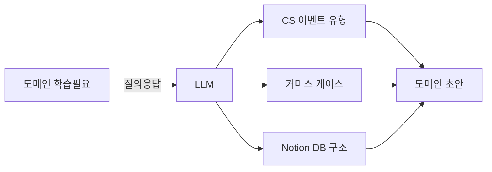
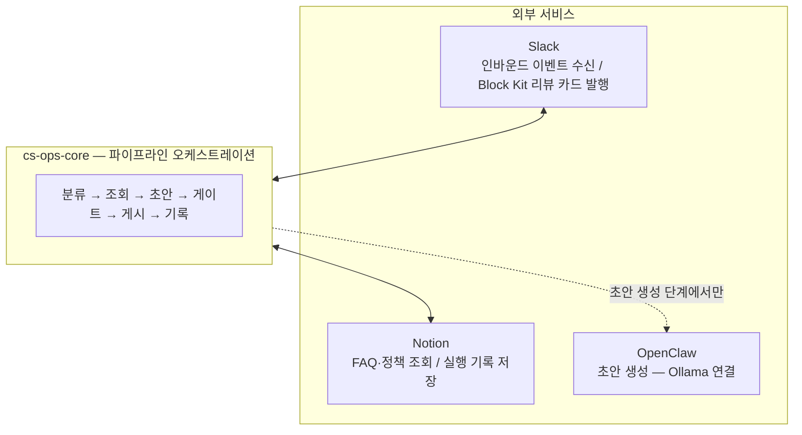

# ax-experience

이 프로젝트는 두 가지 목적으로 만들었습니다.

1. 커머스 CS 자동화에 실제로 무엇이 필요한지 직접 만들면서 파악하기
2. OpenClaw, Hermes, Ouroboros 같은 agentic 도구가 실제로 어느 수준까지 작동하는지 — 하네스, seed, eval을 어떻게 주입해야 하는지 실험하기

목(mock)이나 데모용 코드 없이, 매 단계마다 실제 서비스에 연결하면서 진행했습니다.

---

## Phase 0 — 도메인 초안

**목표:** OpenClaw, Notion, Slack을 연결하기에 앞서, 이 도구들에 담을 인-하우스 도메인 내용을 먼저 정의했습니다.



LLM과 질의응답으로 CS 이벤트 유형, 커머스 케이스, Notion DB 구조를 정의했습니다. Phase 1에서 각 도구에 실제 데이터를 연결할 때 무엇을 연결할지 명확히 하는 게 목적이었습니다.

---

## Phase 1 — 통합 레이어 구축

**목표:** Slack · Notion · OpenClaw를 연결해 CS 자동화 파이프라인을 처음으로 동작하게 만들었습니다.



모든 티켓을 세 경로 중 하나로 결정합니다:

| 경로 | 조건 | 처리 |
|------|------|------|
| `auto` | 정책 매칭 + risk_level low | 드래프트 자동 전송 |
| `review` | risk high / 정책 없음 / 환불 가능성 | Slack Block Kit 카드 → 사람 검토 |
| `escalate` | critical / privacy_request | 에스컬레이션 알림 |

---

## Phase 2 — 함수형 전환 + 에이전트 레이어

**목표:** Phase 1 코드를 함수형 파이프라인으로 재작성하고, seed/eval 기반 에이전트 레이어를 추가했습니다.

```
CS message → classify_ticket → retrieve_evidence → match_policies
           → generate_draft  → apply_risk_gate   → post_review_block
           → log_automation_run
```

- **함수형 전환:** `FlowResult<T>`와 `pipe()`를 활용한 순수 함수 파이프라인으로 재작성
- **Atomic 모듈화:** `classifier/`, `evidence/`, `policy/`, `gate/`, `draft/`, `slack/`, `logging/` 독립 모듈 분리
- **seeds / evals:** Ouroboros seed로 구현을 주도하고, 8개 차원 루브릭으로 파이프라인 실행을 채점
- **E2E 테스트:** Playwright CDP로 실행 중인 Slack Electron과 Notion에 직접 연결, 실제 채널에서 버튼 클릭

---

## Phase 3 — Auto Routing Intelligence + Slack 수집

**목표:** "어떤 CS 문의는 사람이 보지 않아도 되는가"를 풀었습니다.

```
CS message → classify
  ↓
[KB 조회] 알려진 패턴?
  ├── YES → evidence → draft → auto_send (빠른 경로)
  └── NO  → evidence → policy → draft → gate
                ↓ auto
              [LLM Judge]
              ├── safe  → auto_send
              └── unsafe → review
```

- **SQLite 지식 DB:** 알려진 자동 처리 가능 패턴을 저장하고 게이트를 우회
- **LLM Judge:** DB에 없는 엣지 케이스에서 auto 여부를 최종 검증, unsafe면 review로 강등
- **Slack Socket Mode 수집:** 채널 메시지를 WebSocket으로 수신해 파이프라인 자동 트리거

---

## Phase 4 — 타입 안전성 강화 (Zod + ts-pattern)

**목표:** 외부 입력(HTTP body, SQLite row, LLM 응답, ENV)의 `as SomeType` 캐스팅을 체계적으로 제거했습니다.

| 단계 | 대상 | 핵심 변경 |
|------|------|---------|
| P0 | Foundation | Zod + ts-pattern 설치, Result 타입 + DomainError 유니언 정의 |
| P1 | LLM 파싱 경계 | `JSON.parse(...) as T` → `Schema.safeParse()` |
| P2 | HTTP 경계 | `@Body()` / `@Query()`에 Zod 검증 추가 |
| P3 | SQLite 행 캐스트 | `.get/all() as T` → `RowSchema.safeParse()` |
| P4 | ts-pattern 분기 | `if/else-if` 체인 → `match().exhaustive()` |
| P5 | ENV 검증 | `process.env.FOO` → `ConfigSchema.safeParse()` + 시작 시 검증 |

---

## 구조

```
cs-ops-core/       함수형 CS 파이프라인 (포트폴리오 핵심 모듈)
  src/
    classifier/   티켓 정규화 + LLM 인텐트 분류
    evidence/     Notion FAQ + 정책 조회
    policy/       정책 규칙 매칭
    gate/         리스크 게이트 (하드 룰 + 자동 발송 가드)
    draft/        OpenClaw를 통한 LLM 드래프트 생성
    slack/        Block Kit 리뷰 빌더 + 액션 디스패처
    logging/      PII 마스킹 후 Notion에 자동화 실행 기록
    lib/          공용 유틸: Slack 클라이언트, Notion 클라이언트, PII 마스커
  pipeline.ts     최상위 플로우 합성

slack/             Slack Bolt Socket Mode 앱
scheduler/        페이즈 트래커 + 스톨 감지 (개발 중 활용)
seeds/            Ouroboros 평가 시드 (머신 검증 가능한 인수 기준)
e2e/              Playwright CDP E2E 테스트 (실제 Slack 대상)
specs/            아키텍처 문서, 도메인 엔티티, API 계약
api/              NestJS 대시보드 백엔드 (어드민 UI, 케이스 목록)
dashboard/        React 18 어드민 UI
```

---

## 기술 스택

TypeScript · Slack Bolt · `@notionhq/client` · OpenClaw · Ouroboros · Playwright CDP · Jest · NestJS · React + Vite
