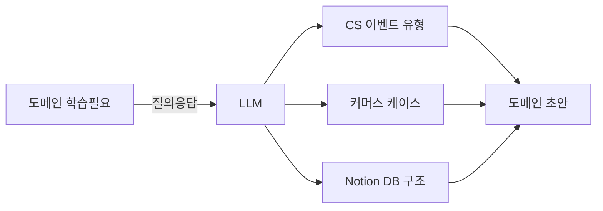
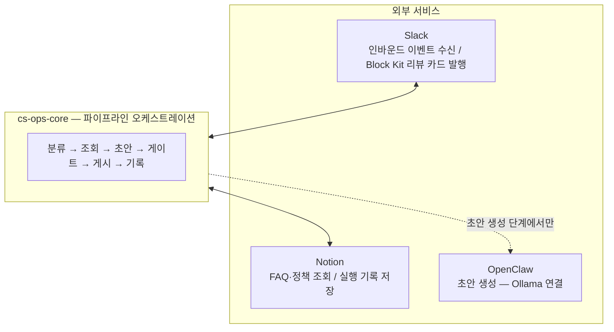

# ax-experience

이 프로젝트는 두 가지 목적으로 만들었습니다.

1. 커머스 CS 자동화에 실제로 무엇이 필요한지 직접 만들면서 파악하기
2. OpenClaw, Hermes, Ouroboros 같은 agentic 도구가 실제로 어느 수준까지 작동하는지 — 하네스, seed, eval을 어떻게 주입해야 하는지 실험하기

목(mock)이나 데모용 코드 없이, 매 단계마다 실제 서비스에 연결하면서 진행했습니다.

---

## Phase 0 — 도메인 초안

**목표:** OpenClaw, Notion, Slack을 연결하기에 앞서, 이 도구들에 담을 인-하우스 도메인 내용을 먼저 정의했습니다. CS와 커머스 도메인을 직접 알지 못했기 때문에, LLM과 질의응답을 통해 초안을 생성했습니다.



**정의한 내용:**

```
CS 이벤트     환불 요청 / 배송 문의 / 계정 이슈 / 불만 / 에스컬레이션
커머스 케이스   주문 취소 / 부분 환불 / 배송 지연 / 쿠폰 오적용
Notion 구조   FAQ 페이지 DB / 정책 문서 DB / Automation Runs DB
```

이 초안이 있어야 Phase 1에서 각 도구에 실제 데이터를 연결할 때 **무엇을** 연결할지 명확해졌습니다.

**진입점을 Slack으로 선택한 이유**

팀이 실시간으로 가장 많이 보는 채널이기 때문입니다. CS 이벤트를 Slack에서 받으면 즉시 확인이 가능하고, 리뷰 카드도 같은 채널에서 처리할 수 있습니다.

실제 서비스로 전환할 때는 CS 백엔드 API response에 middleware hook을 달아서 동일한 파이프라인을 트리거하면 됩니다. 진입점만 바꾸면 파이프라인은 그대로 재사용됩니다.

---

## Phase 1 — 통합 레이어 구축

**목표:** 실제 서비스들을 연결해 CS 자동화 파이프라인을 처음으로 동작하게 만들었습니다.

**구성:**



**추가한 것들:**
- OpenClaw를 연결했습니다. Ollama 기반 드래프트 생성을 로컬에서 직접 돌려보고 싶었기 때문입니다.
- Notion을 두 가지 용도로 썼습니다. FAQ·정책 조회 소스와 실행 기록 저장소로 각각 연결해서 실제 데이터 흐름을 확인하고 싶었기 때문입니다.
- Slack Bolt로 인바운드 이벤트를 받고 Block Kit 리뷰 카드(Accept / Reject / Escalate 버튼)로 결과를 게시했습니다. 실제 Slack 채널에서 파이프라인이 동작하는 걸 확인하고 싶었기 때문입니다.
- scheduler를 추가했습니다. 진행 상태를 추적하고 스톨을 감지할 방법이 필요했기 때문입니다.
- Mock Commerce API(주문/환불/쿠폰)를 추가했습니다. 실 데이터 없이도 결정론적인 로컬 테스트가 필요했기 때문입니다.

**3단계 라우팅**

분류기와 리스크 게이트가 협업해서 모든 티켓을 세 경로 중 하나로 결정합니다:

| 경로 | 조건 | 처리 |
|------|------|------|
| `auto` | 정책 매칭 + risk_level low | 드래프트 자동 전송 (`CS_OPS_ALLOW_AUTO_SEND=true` 시) |
| `review` | risk high / 정책 없음 / 환불 가능성 | Slack Block Kit 카드 → 사람 검토 |
| `escalate` | critical / privacy_request / 정책 에스컬레이션 | 에스컬레이션 알림 |

**OpenClaw를 중앙에 두지 않은 이유**

초안 생성 단계에만 OpenClaw를 연결하고, 파이프라인 전체의 중심에는 두지 않았습니다. 권한 통제와 조직 간 유동성을 고려했기 때문입니다. 외부 서비스에 대한 의존성이 높아질수록 팀 간 경계와 운영 유연성이 줄어든다고 생각합니다

---

## Phase 2 — 함수형 전환 + 에이전트 레이어

**목표:** Phase 1에서 동작은 했지만 코드가 지저분해졌습니다. 추후 기능을 더 얹기 전에 먼저 정리하고 기틀을 만들어두는 게 맞다고 판단했습니다.

Phase 1이 직접 조정하면서 배우는 과정이었다면, Phase 2에서는 agentic이 실제로 어느 수준까지 작동하는지 실험해보고 싶었습니다. Ouroboros로 seed를 주입해 구현을 주도하고, eval로 채점하는 흐름 자체가 Phase 2의 핵심 실험이었습니다.

**코드 구조 변경:**
- **함수형 전환:** 기존 단일 플로우를 `FlowResult<T>`와 `pipe()`를 활용한 함수형 파이프라인으로 재작성했습니다. 각 단계는 순수 함수이며, 에러는 예외 없이 파이프라인을 따라 전파됩니다.
- **Atomic 모듈화:** 파이프라인을 `classifier/`, `evidence/`, `policy/`, `gate/`, `draft/`, `slack/`, `logging/` 등 독립 모듈로 분리했습니다. 각 모듈은 인터페이스를 정의하고 템플릿화해 격리된 상태로 테스트·교체가 가능합니다.

```
CS message → classify_ticket → retrieve_evidence → match_policies
           → generate_draft  → apply_risk_gate   → post_review_block
           → log_automation_run
```

**에이전트·평가 레이어 추가:**
- **seeds** (`seeds/`)를 추가했습니다. 머신이 검증할 수 있는 인수 기준을 담은 YAML 스펙 파일로, Phase 2 파이프라인 자체도 이 방식(`ouroboros run` 워크플로우)으로 빌드했습니다.
- **evals** (`evals/`)를 추가했습니다. Notion에 30개의 평가 케이스를 시딩하고, 8개 차원의 루브릭으로 각 파이프라인 실행을 채점해 결과를 다시 Notion에 기록하는 judge harness를 구현했습니다.
- **Ouroboros**를 평가 실행 엔진으로 활용했습니다. `ouroboros run <seed>`으로 구현을 주도하고, `ouroboros evaluate`로 judge harness를 실행했습니다.
- **Hermes** 멀티에이전트 오케스트레이션을 추가했습니다. 태스크를 서브에이전트에 위임하면 제안 → 승인 → 실행 순으로 독립적으로 처리합니다.
- **실제 E2E 테스트** (`e2e/`)를 추가했습니다. Playwright가 CDP 리모트 포트를 통해 실행 중인 Slack Electron 앱, Notion API, Chrome(`--remote-debugging-port`)에 직접 연결됩니다. 목(mock) 환경 없이 실제 Slack 테스트 채널 안에서 테스트가 실행되며, Accept / Reject / Escalate 버튼을 실제로 클릭합니다.

---

## Phase 3 — Auto Routing Intelligence + Slack Ingestion

**목표:** Phase 2까지는 모든 티켓이 리스크 게이트를 거쳐 사람 검토 큐로 올라갔습니다. 배송 조회처럼 Commerce API에서 바로 답이 나오는 경우도 예외가 없었습니다. Phase 3의 핵심 질문은 "어떤 CS 문의는 사람이 보지 않아도 되는가"였습니다.

두 가지를 풀었습니다:

- **자동 처리 판단**: 알려진 safe 패턴(SQLite KB)을 먼저 확인해 즉시 처리하고, 새로운 패턴은 LLM Judge가 최종 검증한 뒤 자동 발송 여부를 결정합니다. judge가 unsafe로 판단하면 review로 강등합니다.
- **실시간 Slack 인제스션**: CS 담당자가 별도로 API를 호출할 필요 없이, Slack 채널에 메시지가 올라오는 순간 Socket Mode WebSocket 이벤트로 수신해 파이프라인을 자동 트리거합니다.

**Slack 메시지 인제스션:**

`SLACK_CS_EVENTS_CHANNEL`로 지정한 채널에 메시지가 올라오면 Socket Mode WebSocket 이벤트로 수신해 즉시 `process_cs_message`를 호출합니다. 서브타입(봇 메시지, 수정 이벤트 등)과 빈 텍스트는 필터링됩니다.

```
Slack 채널 메시지
  → Socket Mode WebSocket 이벤트
  → messages.ts 핸들러 (채널·서브타입·텍스트 필터)
  → process_cs_message(text, ts)
  → 파이프라인 실행
```

클라우드 환경에서 Socket Mode를 쓸 수 없는 경우 HTTP Events API(`POST /api/slack/events`, HMAC-SHA256 서명 검증)로 교체 가능합니다. 진입점만 바꾸면 파이프라인은 그대로 재사용됩니다.

**설계 방향:**

파이프라인에 두 단계의 판단 레이어를 추가했습니다:

1. **SQLite 지식 DB** (`cs-ops-core/src/knowledge/db.ts`) — 알려진 자동 처리 가능 패턴을 저장합니다. 파이프라인이 이 DB를 먼저 확인해 게이트를 건너뜁니다.

   현재 등록된 패턴 (6개):

   | intent | order_state | max_risk |
   |--------|-------------|----------|
   | `delivery_inquiry` | `in_transit` | low |
   | `delivery_inquiry` | `delivered` | low |
   | `delivery_inquiry` | `cancelled` | low |
   | `delivery_inquiry` | `returned` | low |
   | `delivery_inquiry` | `not_shipped` | low |
   | `refund_request` | *(wildcard)* | low |

   `refund_request` 와일드카드는 환불 자격 확인이 전제입니다. KB 빠른 경로에서 admin API로 `eligible === true`를 확인한 경우에만 자동 발송으로 이어집니다. 자격 미확인(주문번호 없음, `eligible: false`)이면 정상 파이프라인으로 fall-through합니다.

   새 패턴은 `INSERT OR IGNORE`로 upsert되므로 기존 DB에서도 추가 마이그레이션 없이 반영됩니다.

2. **LLM Judge 포트** (`cs-ops-core/src/lib/llm-judge.ts`) — DB에 없는 엣지 케이스에서 게이트가 `auto`를 결정하면 Claude CLI judge가 최종 검증합니다. judge가 `is_auto_safe: false`로 판단하면 review로 강등됩니다.

```
CS message → classify
  ↓
[KB 조회] 알려진 패턴?
  ├── YES → evidence → (refund 시 eligibility 확인) → draft → auto_send (빠른 경로)
  └── NO  → evidence → policy → draft → gate
                ↓ auto
              [LLM Judge]
              ├── safe  → auto_send
              └── unsafe → review
```

**LLM Judge를 API가 아닌 Claude CLI로 구현한 이유**

Claude API 직접 접근 없이도 `claude -p --json-schema` 플래그로 구조화 출력을 받을 수 있습니다. 인터페이스(`LLMJudge` 타입)는 API 구현체로 교체 가능하도록 분리되어 있습니다.

모든 파이프라인 실행 결과는 SQLite에 샘플링되어 자동 처리 패턴을 점진적으로 확장하는 데 활용됩니다.

**E2E 검증**

Playwright CDP로 실행 중인 Slack Electron에 직접 연결해 KB 빠른 경로 전체를 검증합니다 (`e2e/flows/cs-kb-*.e2e.ts`). API 응답에서 `risk_decision.reason === 'knowledge DB fast-path'`를 확인하고, Notion Automation Runs DB에 실행 로그가 기록됐는지까지 검사합니다.

---

## Phase 4 — 타입 안전성 강화 (Zod + ts-pattern)

**목표:** Phase 1~3을 거치면서 외부 입력(HTTP body, SQLite row, LLM 응답, ENV)에 대한 타입 캐스팅이 산발적으로 늘어났습니다. `as SomeType` 캐스트는 런타임 에러를 컴파일 타임에 잡지 못합니다. Phase 4에서는 이를 체계적으로 걷어냈습니다.

**5단계로 나눠 진행:**

| Phase | 범위 | 핵심 변경 |
|-------|------|---------|
| P0 | Foundation | `zod`, `ts-pattern` 설치. `Result<T,E>` / `TaskResult<T,E>` 타입 + `ok/err` 헬퍼 생성. `DomainError` 유니언(`ParseError \| LLMError \| NetworkError \| ValidationError`) 정의. `tsconfig`에 `noImplicitReturns`, `noFallthroughCasesInSwitch` 추가. |
| P1 | LLM 파싱 경계 | `JSON.parse(...) as SomeType` → `Schema.safeParse()` 교체. 대상: `ticket.ts` (TicketSchema), `openclaw-client.ts` (CsBotResponseSchema ×2), `draft-eval.ts` (DraftEvalResponseSchema), `llm-judge.ts` (JudgeOutputSchema). |
| P2 | HTTP 경계 | NestJS 컨트롤러 `@Body()` / `@Query()` 에 Zod 스키마 + `safeParse()` 추가. 실패 시 `BadRequestException`. 대상: cases, ops, metrics, refund, customer, admin/refund 컨트롤러. |
| P3 | SQLite 행 캐스트 | `.get/all() as SomeType` → `RowSchema.safeParse()` + 실패 시 `null` / `[]` 반환. 대상: `case-store.ts`, `automation-run-store.ts`, `metrics-store.ts`, `knowledge/db.ts`. |
| P4 | ts-pattern 분기 | 문자열 리터럴 유니언 위의 `if/else-if` 체인 → `match().with(...).exhaustive()`. 대상: `pipeline/router.ts`, `pipeline.ts`, `gate/risk.ts`, `policy/matcher.ts`, `openclaw-client.ts` ×2, `draft/generator.ts`. |
| P5 | ENV 검증 | `api/src/config.ts`에 `ConfigSchema.safeParse(process.env)` 추가. 실패 시 `process.exit(1)`. 산발적 `process.env.FOO` 접근을 `config.*` 참조로 교체. |

**설계 원칙:**

- `safeParse()` 만 사용 — `.parse()`(예외 던짐) 금지
- ts-pattern은 `.exhaustive()` 만 사용 — `.otherwise()` 금지
- 내부 TypeScript-to-TypeScript 호출에는 Zod 미적용 (이미 타입 안전)
- 에이전트(Ouroboros)가 P0~P5 구현을 주도하고, 독립 검증(tsc + jest)은 오케스트레이터가 직접 실행

**검증 기준 (Definition of Done):**

```
✅ npx tsc --noEmit → 0 errors
✅ npx jest --no-coverage → 206 passed
✅ .parse() (non-safeParse) grep → 0 (parse boundary 파일 기준)
✅ match().otherwise() grep → 0
```

---

## 구조

```
cs-ops-core/       함수형 CS 파이프라인 (포트폴리오 핵심 모듈)
  src/
    classifier/   티켓 정규화 + LLM 인텐트 분류
    evidence/     Notion FAQ + 정책 조회
    policy/       정책 규칙 매칭
    gate/         리스크 게이트 (하드 룰 + 자동 발송 가드)
    draft/        OpenClaw를 통한 LLM 드래프트 생성
    slack/        Block Kit 리뷰 빌더 + 액션 디스패처
    logging/      PII 마스킹 후 Notion에 자동화 실행 기록
    lib/          공용 유틸: Slack 클라이언트, Notion 클라이언트, PII 마스커
  pipeline.ts     최상위 플로우 합성

slack/             Slack Bolt Socket Mode 앱
  src/
    socket-app.ts  Bolt 앱 생성 + Socket Mode 연결
    messages.ts    SLACK_CS_EVENTS_CHANNEL 메시지 → process_cs_message 라우팅
    actions.ts     Block Kit 버튼 액션 핸들러 (accept / deny / escalate)
    blocks.ts      리뷰 카드 Block Kit 빌더
    slack-client.ts WebClient 래퍼

scheduler/        페이즈 트래커 + 스톨 감지 (개발 중 활용)
seeds/            Ouroboros 평가 시드 (머신 검증 가능한 인수 기준)
e2e/              Playwright CDP E2E 테스트 (실제 Slack 대상)
specs/            아키텍처 문서, 도메인 엔티티, API 계약
api/              NestJS 대시보드 백엔드 (어드민 UI, 케이스 목록)
dashboard/        React 18 어드민 UI
```

---

## 기술 스택

TypeScript · Slack Bolt · `@notionhq/client` · OpenClaw · Ouroboros · Playwright CDP · Jest · NestJS · React + Vite
